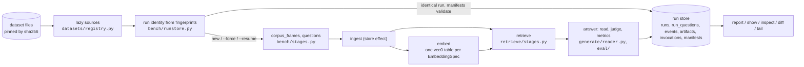

# Flow: what a benchmark run does

Snapshot 2026-09-24. This page follows one `triplum bench run` from the command line to the row
in the run store, names the module that implements each step, and lists what exists versus what
the design record still plans. The caching and identity rules it relies on are in
[benchmarking.md](benchmarking.md); the decisions behind the shape are in
[research/design.md](research/design.md).

## At a glance

Everything below `load` runs inside `bench/runner.py: run_experiment`, which is the only place
that composes stages. A stage is a plain function in `bench/stages.py` wrapped by
`triplum.stage.stage`: under the run it gets a data key from its arguments, records the code it
executed as a manifest, publishes its output as an artifact and writes an invocation row, and on
the next run it is fetched when the key matches and its manifest and its inputs' manifests still
validate (see [benchmarking.md](benchmarking.md)). The store enforces
visibility, so every stage passes a `Viewer` through.

## Step by step

| # | step | module | what happens | recorded / cached |
|---|---|---|---|---|
| 1 | load dataset | `datasets/registry.py`, `datasets/base.py`, one module per source | Builds a `Benchmark` of lazy sources (corpus, questions, gold triples), or the committed fixture. Nothing is read to construct it; a source fetches and verifies its pinned files on first iteration. `--n` selects questions with `Take` and never truncates the corpus. Custom compositions pass as `data=` without registration. QA runs reject missing QA, unmet `needs`, or corpus-less retrieval. | Corpus and evaluation identities are the sources' fingerprints (pinned digests, parser version, record contract), so an identity lookup never parses a dataset. Chunk ids are `chunk_id(document_id, ordinal)`, stable between fixture and full corpus. |
| 2 | build components | `bench/factories.py` | Embedder, reader LLM, judge LLM and reranker are built from the frozen configs. Each is wrapped in the disk cache keyed on the full effective request (model, prompt, params, adapter id). The judge must come from a different model family than the reader. | Call cache under `<cache root>/`. |
| 3 | run identity | `bench/runstore.py`, `bench/runner.py: run_valid` | Hashes dataset, pipeline, config, corpus and question fingerprints, embedding and reranker spec, reader and judge model, seed, replicate, viewer, and both prompt hashes, before anything is read. A completed run with that identity is returned when the manifests of every stage it ran still validate; a code edit anywhere those stages executed means the pipeline runs again and each stage fetches or recomputes on its own. `--force` starts a fresh run whose stages still fetch; `--resume` continues a running or failed run with the same identity, its finished questions served from the call cache. `--replicates N` runs N replicates under derived seeds. | `runs` row with the identity fields, `experiment_id`, `replicate`, git sha, dirty flag, host and, at the end, `code_hash` over the stage manifests; `prices` snapshot for the models used. |
| 4 | corpus and questions | `bench/stages.py: corpus_frames, questions` | The corpus read once through loaders and collators into the canonical frames, and the questions frame with the cross-source checks (unique document ids, every gold chunk in the corpus). | Artifacts `frames` and `frame`, fetched by every later run over the same sources. |
| 5 | ingest | `bench/stages.py: ingest` | One SQLite file per corpus at `stores/<dataset>-<corpus hash>.sqlite`, bound to that corpus by hash. Documents, grants and chunks are written once; FTS5 rows and ACL tokens are maintained by triggers. | A store effect: the store's `effects` table answers the next run. Event `index.documents`. |
| 6 | embed | `bench/stages.py: embed` | Dense and hybrid only. Finds the chunks that have no vector for this `EmbeddingSpec`, embeds them in batches through the cached embedder, and writes them to a sqlite-vec `vec0` table named after the spec hash and partitioned by ACL hash. | A store effect. Event `index.embed`. Vectors persist in the store; the call cache makes a second machine-local run free. |
| 7 | retrieve | `bench/stages.py: retrieve` over `retrieve/stages.py` | One call over all questions, returning `(question_id, chunk_id, rank, score)`. Filtering by viewer happens inside the store's FTS and vector queries, before the top-k cut. | Artifact `frame`. Event `retrieve` with reranker call counts. |
| 8 | answer | `bench/stages.py: answer` over `generate/reader.py`, `eval/judge.py`, `eval/metrics.py` | Per question: the top-k passages and the question go into one prompt with a JSON answer schema; the optional judge asks whether the answer matches any gold alias; EM and token F1 with HotpotQA normalisation, max over aliases; Contain-Acc; Judge-Acc; R@2 and R@5 on gold passages; tokens, USD, latency, passage count. Seeded through the reader and judge adapters. | One `run_questions` row per question, committed in its own transaction with its `read` and `judge` events, so a crash loses at most one question. Artifact `frame` of the content columns; a replicate with a seed-sensitive reader recomputes it, one with a deterministic reader fetches it. |
| 9 | finish | `bench/runner.py` | Records the store identity as an artifact, sets the run status to `ok` or `failed`, and stores wall time and cache hit and miss counts. | `run_artifacts`, `runs.status`. |

## Pipelines

`--pipeline` selects a named pipeline from `retrieve/pipelines.py` (a composition of the stages
with defaults, importable and overridable from Python); the reader, judge and metrics are the
same for all.

| pipeline | retrieval | needs |
|---|---|---|
| `closed_book` | nothing; the reader sees only the question | reader |
| `bm25` | FTS5 BM25 over the viewer's chunks, top k | |
| `dense` | query embedding, sqlite-vec KNN per eligible ACL partition, exact visibility check, top k | embedder |
| `rrf` | dense and BM25 candidates (`--candidates` each) fused by reciprocal rank fusion, top k by fused score | embedder |
| `hybrid` | the `rrf` fusion, then the top `--candidates` reranked by a cross-encoder, top k | embedder, reranker |
| `oracle` | the gold supporting passages, in gold order | |

`bench sweep` runs `dense` once per embedding spec in a JSON file and continues past a spec that
fails to load.

## An extraction run

`triplum bench extract` (library: `bench.runner.run_extraction(ExtractConfig)`) builds the
graph for a dataset with a non-LLM extractor and scores it against the gold triples.

| # | step | module | what happens | recorded / cached |
|---|---|---|---|---|
| 1 | load | as above | Any dataset with a corpus, questions or not; `triples` is the gold where the source has it. `questions_hash` covers questions and triples. | |
| 2 | identity | `bench/runstore.py`, `bench/runner.py: run_valid` | The **run identity** is corpus and gold fingerprints, extractor and resolver spec hashes, viewer, with `kind = extract` in the one `runs` envelope; a completed run is returned when its stage manifests validate. The **graph identity** is the content hash of the resolved graph frames, known once they exist. | `runs` row; `extractor_spec`, `resolver_spec`, `graph_identity` columns |
| 3 | claims and ground | `bench/stages.py: claims, ground` over `extract/rules.py` or `extract/small_model.py` and `extract/stages.py: ground` | The extractor returns spans and claims per chunk (cached per chunk on the spec hash and the text); grounding turns accepted claims into entities (id = hash of document and normalised surface), mentions, `label` and `type` facts, and one fact with one single-chunk support group per claim. Rejected claims stay in the `claims` frame with their status. `small_model` takes its entity and relation vocabularies from the config, or from the dataset's metadata and gold predicates. | Artifacts `frames` (spans and claims; the five graph frames). Event `extract`, `cached` when every chunk hit the cache. Grounding runs once per identity. |
| 4 | resolve | `bench/stages.py: resolve` over `extract/stages.py: resolve` | `none`, `exact` or `fuzzy`: one `same_as` fact per linked pair of entities from different documents, supported by a group holding a mention chunk of each side; `canonical_id` filled by union for reporting. | Artifact `frames`; runs once per identity. |
| 5 | index graph | `bench/stages.py: graph` | Written once per graph identity into the corpus's store; a store holding another graph identity is refused. | A store effect. Event `index.graph`; `graph_written` on the run |
| 6 | score | `eval/triples.py` | Surface triples from the facts, matched one-to-one against the gold per document (per question for 2Wiki evidences, recall only): `exact` and `partial`; span P/R/F1 where the dataset lists entities; counts and claims by status. | `extraction_runs` row |

Typed relation scores for CoNLL04 and SciERC are meaningful for `small_model`, whose relation
vocabulary is the dataset's; for `rules` the predicate is the verb lemma, so its exact score on
typed sets is a floor, not a comparison.

## Commands and the steps they touch

| command | does |
|---|---|
| `triplum data` | lists every registered dataset with family, default and large flags, and whether its cached files are absent, partial, verified, or invalid; does not download anything |
| `triplum data fetch [--dataset <name>\|default\|all]` | download and verify files ahead of use; bare `fetch` is the default protocol, `all` skips large datasets, which download only when named or iterated |
| `triplum data verify --dataset <name>` | reads a whole dataset and checks that document ids are unique and every gold chunk exists; a folder path works too |
| `triplum bench [--runstore <path>]` | read-only overview of supported pipelines and up to ten recent local runs, with a status table and compact action hints; full help via `--help`; does not create or migrate a database |
| `triplum bench run` | steps 1 to 10 for one configuration |
| `triplum bench sweep --embedders <json>` | `bench run` with `--pipeline dense` per embedding spec |
| `triplum bench extract --dataset <name> [--extractor rules\|small_model] [--resolver none\|exact\|fuzzy]` | the extraction run above; `--entity-types` and `--relation-types` set `small_model`'s vocabularies |
| `triplum bench report` | every run as grouped identity, quality and cost field/value pairs wrapped to terminal width; QA runs first, then extraction runs; all metrics retained, missing values shown as `n/a`, floats at six significant digits |
| `triplum bench show <run>` | identity fields and the full config JSON of one run |
| `triplum bench rerun <run> [--force] [--resume]` | replays a stored config through step 3 onwards |
| `triplum bench inspect <run> [--question <id>] [--json]` | answers, metrics, retrieved passages and model calls per question |
| `triplum bench diff <a> <b>` | identity and config fields that differ, metric means, per-question deltas |
| `triplum bench tail <run> [--once]` | done/total and latest stage of a running benchmark |
| `uv run marimo edit notebooks/runs.py` | the same summary frame in a notebook |

The call cache, one store per corpus and `runs.db` live under the cache root (`$TRIPLUM_CACHE`,
default `~/.cache/triplum`); `--cache-root` and `--runstore` override it. Dataset files live
under `$TRIPLUM_DATA` (default `~/.cache/triplum/data`) regardless of the cache root.

## Current rewrite boundary

The implemented modules and public interfaces are mapped in [api/index.md](api/index.md).
The runner currently materializes corpus frames before ingestion. The next foundation change
is store-owned, batch-atomic ingestion; the [stack walk](plans/2026-09-17-stack-walk.md)
tracks the subsequent interfaces and the [caching gap map](specs/2026-09-17-caching-and-monitoring.md)
tracks the requirements still open. Graph retrieval, LLM extraction and store comparison follow
those interfaces and the temporal/ACL fixture gate. The earlier fixture-scale extraction
measurements and development records are recoverable from the
[temporary note](notes/previous-foundation.md).

## CLI input and views

The CLI resolves finite choices and prompts only on terminals; the
[selection contract](specs/2026-09-16-cli-selection.md) defines the behavior.
Benchmark text views wrap identifiers and use terminal-aware color; structured output remains JSON.
