# Flow: what a benchmark run does

Snapshot 2026-09-16. This page follows one `triplum bench run` from the command line to the row
in the run store, names the module that implements each step, and lists what exists versus what
the design record still plans. The caching and identity rules it relies on are in
[benchmarking.md](benchmarking.md); the decisions behind the shape are in
[research/design.md](research/design.md).

## At a glance

```mermaid
flowchart LR
  DS[("dataset files<br/>pinned by sha256")] --> LOAD["load<br/><code>eval/datasets/registry.py</code>"]
  LOAD --> ID["run identity<br/><code>bench/runstore.py</code> + <code>bench/fingerprint.py</code>"]
  ID -- "identical run exists" --> RS
  ID -- "new / --force / --resume" --> DOCS["ensure_documents<br/><code>bench/index.py</code>"]
  DOCS --> EMB["ensure_embeddings<br/>one vec0 table per EmbeddingSpec"]
  DOCS --> RET
  EMB --> RET["retrieve<br/><code>retrieve/stages.py</code>"]
  RET --> READ["read<br/><code>generate/reader.py</code>"]
  READ --> JUDGE["judge (optional)<br/><code>eval/judge.py</code>"]
  READ --> MET["metrics<br/><code>eval/metrics.py</code>"]
  JUDGE --> MET
  MET --> RS[("run store<br/>runs, run_questions, events, prices, artifacts")]
  RS --> OUT["report / show / inspect / diff / tail"]
```

Everything below `load` runs inside `bench/runner.py: run_benchmark`, which is the only place
that composes stages. Stages themselves are plain functions taking Polars frames and returning
Polars frames; the store enforces visibility, so every stage passes a `Viewer` through.

## Step by step

| # | step | module | what happens | recorded / cached |
|---|---|---|---|---|
| 1 | load dataset | `eval/datasets/registry.py`, `base.py`, one parser module per source | Looks the dataset up in the registry, fetches its pinned files into the data root, verifies sha256, and parses them into the canonical frames: one document and one chunk per passage, one public grant per document, questions with `gold_chunk_ids` resolved from the source's gold, `answerable`, `as_of` and a JSON `metadata` column for source extras, gold `triples` where the source has them. `--fixture` loads the committed canonical 20-question fixture instead; `--n` truncates. The runner refuses extraction-only datasets, datasets with a `needs` note (a runner capability still missing), and non-closed-book pipelines on corpus-less datasets. | `corpus_hash` and `questions_hash` are hashes of the parsed frames, not the source bytes, so a parser change invalidates stores and runs. A gold passage that cannot be mapped is an error, never a silent miss. |
| 2 | build components | `bench/factories.py` | Embedder, reader LLM, judge LLM and reranker are built from the frozen configs. Each is wrapped in the disk cache keyed on the full effective request (model, prompt, params, adapter id). The judge must come from a different model family than the reader. | Call cache under `<cache root>/cache/`. |
| 3 | run identity | `bench/runstore.py`, `bench/fingerprint.py` | Hashes dataset, pipeline, config, the source of every module the pipeline executes (not the git sha), corpus and question hashes, `n`, embedding and reranker spec, reader and judge model, seed, viewer, and both prompt hashes. An identical completed run is returned without doing anything. `--force` starts a fresh run; `--resume` continues a running or failed run with the same identity from its last committed question. | `runs` row with all identity fields plus git sha, dirty flag and host; `prices` snapshot for the models used. |
| 4 | index documents | `bench/index.py: ensure_documents` | One SQLite file per corpus at `stores/<dataset>-<corpus hash>.sqlite`, bound to that corpus by hash. Documents, grants and chunks are written once; FTS5 rows and ACL tokens are maintained by triggers. | Event `index.documents`. Skipped when the store already holds the corpus. |
| 5 | index embeddings | `bench/index.py: ensure_embeddings` | Dense and hybrid only. Finds the chunks that have no vector for this `EmbeddingSpec`, embeds them in batches through the cached embedder, and writes them to a sqlite-vec `vec0` table named after the spec hash and partitioned by ACL hash. | Event `index.embed` with token counts. Vectors persist in the store; the call cache makes a second machine-local run free. |
| 6 | retrieve | `retrieve/stages.py` | One call over all questions, returning `(question_id, chunk_id, rank, score)`. Filtering by viewer happens inside the store's FTS and vector queries, before the top-k cut. | Event `retrieve` with reranker call counts. |
| 7 | read | `generate/reader.py` | Per question: the top-k passages and the question go into one prompt with a JSON answer schema; the reader is cached, so a rerun with the same request pays nothing. | Event `read` with tokens, cost and cache flag. |
| 8 | judge | `eval/judge.py` | Optional. Asks the judge model whether the answer matches any gold alias. | Event `judge`. |
| 9 | metrics | `eval/metrics.py` | EM and token F1 with HotpotQA normalisation, max over aliases; Contain-Acc; Judge-Acc; R@2 and R@5 on gold passages; tokens, USD, latency, passage count. | One `run_questions` row per question, committed in its own transaction, so a crash loses at most one question. |
| 10 | finish | `bench/runner.py` | Records the store file as an artifact with its hash, sets the run status to `ok` or `failed`, and stores wall time and cache hit and miss counts. | `run_artifacts`, `runs.status`. |

## Pipelines

`--pipeline` selects the retrieval stage; the reader, judge and metrics are the same for all.

| pipeline | retrieval | needs |
|---|---|---|
| `closed_book` | nothing; the reader sees only the question | reader |
| `bm25` | FTS5 BM25 over the viewer's chunks, top k | |
| `dense` | query embedding, sqlite-vec KNN per eligible ACL partition, exact visibility check, top k | embedder |
| `hybrid` | dense and BM25 candidates fused by reciprocal rank fusion, top `--candidates` reranked by a cross-encoder, top k | embedder, reranker |
| `oracle` | the gold supporting passages, in gold order | |

`bench sweep` runs `dense` once per embedding spec in a JSON file and continues past a spec that
fails to load.

## Commands and the steps they touch

| command | does |
|---|---|
| `triplum data` | lists every registered dataset with family, default and large flags, and whether its cached files are absent, partial, verified, or invalid; does not download anything |
| `triplum data fetch [--dataset <name>\|default\|all]` | step 1 only: download and verify files; bare `fetch` is the default protocol, `all` skips large datasets, which download only when named |
| `triplum bench [--runstore <path>]` | read-only overview of supported pipelines and up to ten recent local runs, with state/action explanations and generated command help; does not create or migrate a database |
| `triplum bench run` | steps 1 to 10 for one configuration |
| `triplum bench sweep --embedders <json>` | `bench run` with `--pipeline dense` per embedding spec |
| `triplum bench report` | every run as a compact block of field/value pairs wrapped to terminal width; all metrics retained, missing values shown as `n/a`, floats at six significant digits |
| `triplum bench show <run>` | identity fields and the full config JSON of one run |
| `triplum bench rerun <run> [--force] [--resume]` | replays a stored config through step 3 onwards |
| `triplum bench inspect <run> [--question <id>] [--json]` | answers, metrics, retrieved passages and model calls per question |
| `triplum bench diff <a> <b>` | identity and config fields that differ, metric means, per-question deltas |
| `triplum bench tail <run> [--once]` | done/total and latest stage of a running benchmark |
| `uv run marimo edit notebooks/runs.py` | the same summary frame in a notebook |

Everything lives under the cache root (`$TRIPLUM_CACHE`, default `~/.cache/triplum`): datasets,
the call cache, one store per corpus, and `runs.db`. `--cache-root` and `--runstore` override it.

## Implemented and planned

Implemented (sub-project 2, part 1; spec in
[specs/2026-09-16-harness-and-baselines.md](specs/2026-09-16-harness-and-baselines.md)):

- **Data layer**: the eight canonical Arrow schemas in `crates/triplum-core`, exposed through
  `triplum._core`; `Viewer` with principals and both as-of instants.
- **Store**: SQLite, chunk side only: documents, system-versioned grants, chunks, FTS5 with ACL
  tokens, sqlite-vec per embedding spec. The `entities`, `facts`, `fact_support` and `mentions`
  tables are created by the migration and unused.
- **Protocols with disk cache**: `LLM` (OpenAI-compatible, CLI subprocess, fake), `Embedder`
  (OpenAI-compatible, sentence-transformers, fastembed, fake), `Reranker` (cross-encoder, fake).
- **Datasets**: a registry (`eval/datasets/registry.py`) of pinned, auto-fetched datasets with one
  parser per source and canonical 20-question fixtures; HotpotQA, MuSiQue, 2WikiMultiHopQA under
  the HippoRAG 1000-question protocol are the default set. The registry spec is
  `docs/specs/2026-09-17-dataset-registry.md`.
- **Pipelines**: the five above. **Metrics**: EM, F1, Contain-Acc, Judge-Acc, R@2, R@5, cost,
  latency, indexing time.
- **Run store and tooling**: identity lookup, force, resume, price snapshots, events, and the
  commands in the table above.

Where the code differs from the spec's architecture sketch: there is no `ingest/chunking.py`
(the protocol makes one passage one chunk, so the loader builds chunks directly); the retrieval
stages live in one file, `retrieve/stages.py`; one loader covers all three datasets; FTS and
vector logic sit inside `store/sqlite/store.py`; there is no API reranker adapter and no
`data/frames.py`.

Planned, in the order of the design record:

1. **Temporal and ACL contract fixtures** at toy scale, gating on zero retrieval-level leakage,
   before any graph ingestion.
2. **2a, graph retrieval pipelines**: hierarchical chunking, entity and fact extraction into the
   graph tables, Liao et al. best-practice GraphRAG, personalised PageRank over the KG, and a
   graph-disabled ablation with the same evidence budget.
3. **2b, KG-construction variants**: open IE versus schema-based versus ontology-aware
   extraction, atomic-fact decomposition on and off, entity-resolution variants; intrinsic and
   downstream measurement.
4. **2c, SQLite versus Neo4j** behind the same `Store` protocol.
5. **2d, embedding sweep**: the harness for it exists; the local-model runs are in progress and
   the winner gets pinned for 2a to 2c.
6. Further backends (Oxigraph, LadybugDB), the temporal and ACL synthetic benchmark, KG
   construction V&V, private benchmarks.

## Forgiving CLI input

Snapshot 2026-09-17. The CLI resolves finite human choices before calling exact library
APIs: commands, runs, question IDs, datasets, pipelines, reader/judge kinds and adapter
prefixes. Exact matches win, then case-insensitive exact/unique prefixes. Single substring/typo matches also resolve with a stderr notice; missing or ambiguous
selectors offer terminal choices with no default. Omitted
question filters still mean all questions. Missing stores and unknown selectors give usage
errors instead of tracebacks; run selection does not create an absent store.

Use `--no-input` at the root, group or prompting command to prohibit prompts. Nonterminal
input or stderr also prohibits prompting; errors list canonical candidates. Prompts and
resolution notices use stderr so JSON stdout stays parseable. Model suffixes, paths, URLs,
JSON configs and library identifiers remain exact; unknown option names use Typer's
built-in suggestions. See the [selection contract](specs/2026-09-16-cli-selection.md).
