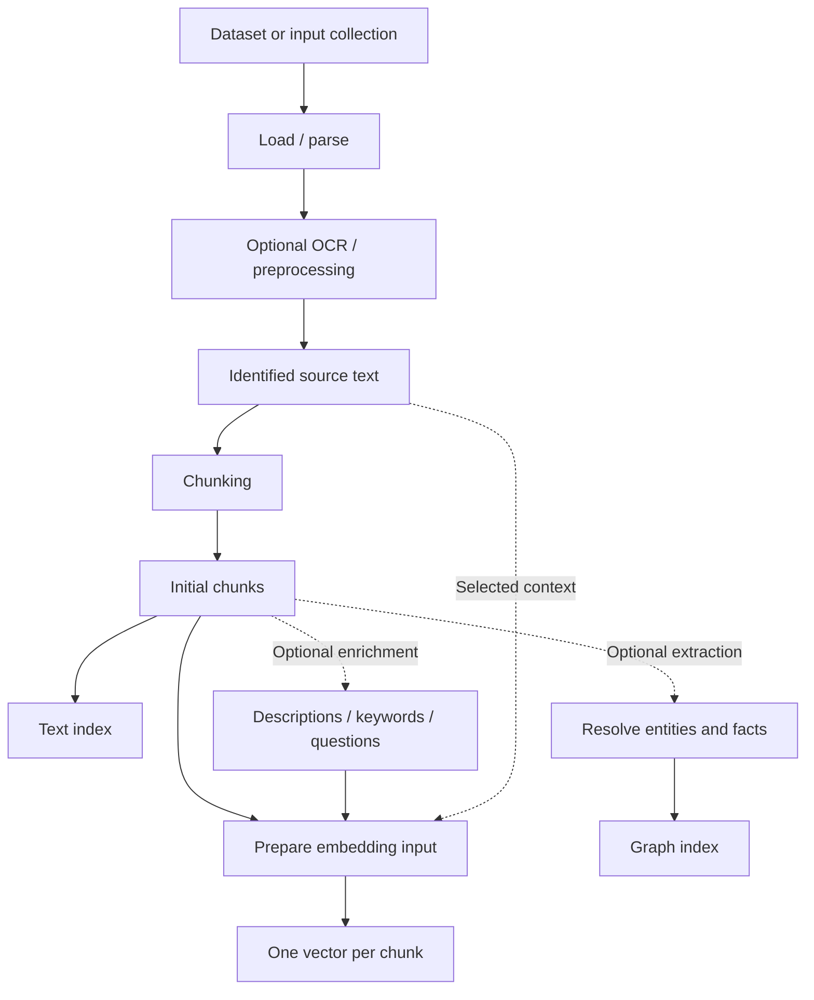
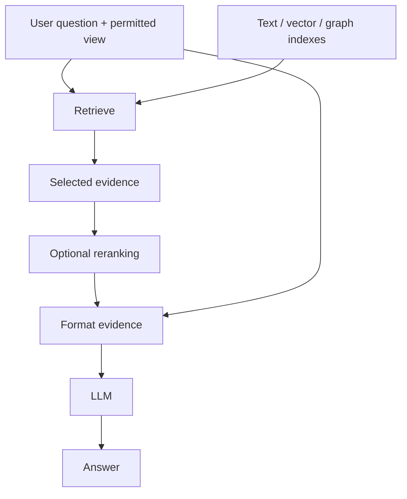

# Indexing and retrieval

**Indexing prepares source material for search. Retrieval selects evidence for a question.**
This page follows the intended flow and shows where experiments can replace individual steps.

## Implemented foundations

- [Datasets/loaders](concepts/datasets.md), [Source](concepts/source.md) and
  [Chunk](concepts/chunk.md) records, and the four [indexing step contracts](concepts/decisions.md)
  have initial implementations. `ZeroEmbedder` is a shape-only placeholder.
- [Collection](concepts/collection.md) has a baseline record and SQL mapping; membership fields,
  collection storage operations and derived-record scope enforcement are not implemented.
- [Record stores](infrastructure/store.md) support memory and SQL persistence.
  [Computation caching](infrastructure/cache.md) supports optional intermediate-result reuse,
  per-computation SQLite tables and CLI/library inspection and clearing.
  [Fingerprintable data models](infrastructure/cache/fingerprints.md) provide field-value identity
  for use with the cache decorators, with explicit bookkeeping exclusions.
- Indexing/ingestion prototypes remain under review. Text/vector search, graph retrieval and
  answer generation are intended responsibilities, not a supported end-to-end pipeline.

The diagrams below show those responsibilities, not a mandatory sequence of classes.

## 1. Indexing: prepare searchable evidence


```mermaid
flowchart TD
    A[Dataset or input collection] --> B[Load / parse]
    B --> C[Optional OCR / preprocessing]
    C --> S[Identified source text]
    S --> H[Chunking]
    H --> K[Initial chunks]
    K --> T[Text index]
    K --> P[Prepare embedding input]
    K -. Optional enrichment .-> E[Descriptions / keywords / questions]
    E --> P
    S -. Selected context .-> P
    P --> V[One vector per chunk]
    K -. Optional extraction .-> G[Resolve entities and facts]
    G --> GI[Graph index]
```

### Obtain source text

A loader obtains a document, webpage or other input. Parsing, optional OCR and preprocessing make
its text available as a [Source](concepts/source.md). The basic record exists; richer provenance
and loader/OCR interfaces remain open.

### Produce initial chunks

Chunking chooses the portions to retrieve. A simple approach keeps the whole text as one chunk;
others split it into smaller or overlapping pieces. Initial chunks need a relationship back to
the source. Hierarchical chunking may also preserve sections and their contained passages.

Current offsets address `Source.text`. Representing earlier text versions and hierarchical
containment remains open.

### Optionally enrich and embed

Embedding preparation chooses which text and context contribute to a chunk's vector. The basic
case uses the chunk text unchanged. An advanced case adds generated descriptions or questions:

```text
Original:    Returns are accepted within 30 days of purchase.
Description: This shop's returns policy.
Question:    How long do I have to return a purchase?
                         ↓ preparation and embedding
                    One chunk vector
```

These are several associated strings, with **one indexed vector per chunk per chosen embedding
configuration**. How they combine is undecided. A generated indexing question is enrichment;
it is not the question a user later asks, nor an evaluation answer.

Original evidence and generated text need distinguishable provenance. Their physical types are
still open. Preparation and encoding should be replaceable without requiring a pipeline registry.

### Add graph and summary branches when needed

Extraction identifies candidate entities and relations from evidence. Resolution connects mentions
to entities and produces supported facts. This branch need not consume the text prepared for
embedding, and basic text retrieval does not require it.

Advanced pipelines may group graph entities into communities and summarize their evidence, or
summarize a document's chunk hierarchy. Community membership and document containment are different
relationships. Summaries can depend on multiple sources. Whether summaries share a type with chunks,
and how they are indexed, remain undecided.

## 2. Retrieval: select evidence for a question


```mermaid
flowchart TD
    Q[User question + permitted view] --> R[Retrieve]
    I[Text / vector / graph indexes] --> R
    R --> E[Selected evidence]
    E --> O[Optional reranking]
    O --> F[Format evidence]
    Q --> F
    F --> L[LLM]
    L --> A[Answer]
```

1. **Retrieve.** Search text, vectors or graph relationships for relevant evidence. Vector search
   may encode the user's question; this is separate from embedding source chunks during indexing.
2. **Optionally rerank.** Reassess candidate relevance to the question.
3. **Format.** Present the selected evidence to the model: for example passages, triples or graph
   structure. The retrieval output's exact shape is undecided, including how graph facts and
   supporting passages travel together.
4. **Answer.** Give the question and formatted evidence to the LLM.

The intended store contract requires every read to respect the permitted viewer and requested
temporal view; current record stores do not yet implement these filters. Permission
filtering belongs before ranking; graph traversal uses the visible graph. Derived summaries must
preserve their supporting sources' access restrictions.

## Composing and reusing steps

Choose the branches the experiment needs: basic text retrieval, enriched vectors, graph records
or summaries. [Decision points](concepts/decisions.md) lists current replacement boundaries.

[Optional caching](infrastructure/cache.md) lets selected steps or larger blocks reuse results.
Equal intermediate content can reuse downstream work even when different upstream processes
produced it. Configured computations select effective settings and dependencies explicitly while
loaded application code contributes automatically to their identity; no manual version bump is
required. See [computation fingerprints](infrastructure/cache/computations.md). Source/Chunk
identity changes and benchmark cache policy remain under review.
